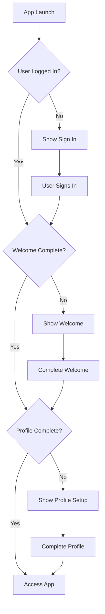

# 🔐 Authentication & Profile System

This document describes the comprehensive authentication middleware and profile management system implemented in the Aura Wellness Coach app.

## 🌟 Features

- ✅ **Authentication Middleware** - Centralized auth state management
- ✅ **Protected Routes** - Component-based route protection  
- ✅ **Profile Completion Guards** - Prevent access until profile is complete
- ✅ **Enhanced Profile Setup** - Beautiful, comprehensive profile form
- ✅ **Navigation Spinners** - Smooth transitions with loading states
- ✅ **TypeScript Support** - Full type safety throughout
- ✅ **Custom Hooks** - Reusable authentication logic

## 🏗️ Architecture

### Core Components

```
app/
├── middleware/
│   └── AuthMiddleware.tsx       # Main authentication middleware
├── hooks/
│   └── useAuthGuard.tsx        # Authentication hooks
├── (screens)/
│   └── enhanced-profile.tsx    # Enhanced profile setup
└── providers/
    └── AuthProvider.tsx        # Authentication context

components/common/
└── ProtectedRoute.tsx          # Route protection components
```

## 🚀 Usage

### 1. Protected Routes

Wrap any component that requires authentication:

```tsx
import { FullyAuthenticated } from "../../components/common/ProtectedRoute"

export default function MyProtectedScreen() {
  return (
    <FullyAuthenticated>
      <MyScreenContent />
    </FullyAuthenticated>
  )
}
```

#### Available Protection Components

- **`AuthenticatedOnly`** - Requires login only
- **`ProfileRequired`** - Requires login + profile completion
- **`WelcomeRequired`** - Requires login + welcome flow
- **`FullyAuthenticated`** - Requires login + profile (most common)

### 2. Custom Protection

For more control, use the base `ProtectedRoute` component:

```tsx
<ProtectedRoute 
  requireAuth={true}
  requireProfile={true}
  requireWelcome={false}
  redirectTo="/custom-setup"
  alertTitle="Setup Required"
  alertMessage="Please complete setup to continue"
>
  <YourComponent />
</ProtectedRoute>
```

### 3. Authentication Hooks

#### `useAuthGuard` - Programmatic Protection

```tsx
import { useAuthGuard } from "../hooks/useAuthGuard"

function MyComponent() {
  const { isAllowed, loading } = useAuthGuard({
    requireAuth: true,
    requireProfile: true,
    redirectTo: '/profile',
    alertMessage: 'Please complete your profile'
  })

  if (loading) return <LoadingSpinner />
  if (!isAllowed) return null // Will auto-redirect

  return <MyProtectedContent />
}
```

#### Simple Hooks

```tsx
// Check authentication status
const { isAuthenticated, loading, user } = useIsAuthenticated()

// Check profile completion
const { isProfileComplete, needsProfile } = useIsProfileComplete()

// Require authentication (with auto-redirect)
const { user, loading } = useRequireAuth('/signin')

// Require profile (with auto-redirect)  
const { isComplete } = useRequireProfile('/profile')
```

### 4. Enhanced Profile Setup

The new profile setup provides:

- 📋 **Progressive form** with completion tracking
- ✅ **Real-time validation** with helpful error messages
- 🎯 **Fitness level selection** with descriptions
- 🔒 **Privacy settings** for user control
- 📊 **Progress indicator** showing completion status
- 💾 **Auto-save** with Firebase integration

## 🔄 Authentication Flow



## 🛡️ Route Protection Levels

### Level 1: Public Routes
- `/signin`, `/signup`
- No authentication required

### Level 2: Authenticated Routes  
- Requires: User login
- Blocks: Unauthenticated users
- Example: Basic settings

### Level 3: Profile Required Routes
- Requires: User login + completed profile
- Blocks: Users with incomplete profiles
- Example: Chat, Habits, Main app features

### Level 4: Welcome Required Routes
- Requires: User login + welcome flow completion
- Blocks: New users who haven't seen welcome
- Example: Special onboarding content

## ⚡ Performance Features

- **Lazy Loading** - Components load only when needed
- **Spinner Integration** - Smooth transitions with loading states
- **Optimistic Updates** - UI responds immediately
- **Caching** - Firebase profile data cached locally
- **Real-time Sync** - Profile changes sync across sessions

## 🎨 UI/UX Features

### Profile Setup Form
- **Progress Tracking** - Visual completion percentage
- **Section Organization** - Grouped related fields
- **Input Validation** - Real-time error checking
- **Accessibility** - Proper labels and ARIA support
- **Responsive Design** - Works on all screen sizes

### Navigation Integration
- **Loading Spinners** - Different animations for different states
- **Smooth Transitions** - No jarring redirects
- **User Feedback** - Clear messages about required actions
- **Persistence** - Form data preserved during navigation

## 🔧 Configuration

### Environment Variables
```env
# Required in .env.local
FIREBASE_API_KEY=your_api_key
EXPO_PUBLIC_CF_CHAT_ENDPOINT=your_chat_endpoint
```

### Profile Completion Rules

Profile is considered complete when these fields are present:
- ✅ Name
- ✅ Age (10-120)
- ✅ Gender
- ✅ Height (positive number)
- ✅ Weight (positive number)  
- ✅ Goals (min 10 characters)

Defined in: `app/lib/profile.ts`

## 🚨 Error Handling

### Authentication Errors
- **Network failures** - Graceful degradation
- **Invalid credentials** - User-friendly messages
- **Session expiry** - Automatic re-authentication prompt

### Profile Errors
- **Validation errors** - Inline field-specific feedback
- **Save failures** - Retry mechanisms with user notification
- **Data corruption** - Fallback to safe defaults

## 🧪 Testing

### Manual Testing Checklist

1. **Unauthenticated User**
   - [ ] Cannot access protected routes
   - [ ] Redirected to signin
   - [ ] Can access public routes

2. **Authenticated User (No Profile)**
   - [ ] Cannot access main app
   - [ ] Redirected to profile setup
   - [ ] Profile form validates correctly
   - [ ] Can complete profile and access app

3. **Authenticated User (Complete Profile)**
   - [ ] Can access all app features
   - [ ] Can update profile
   - [ ] Cannot access auth routes

### Integration Points

- **Firebase Auth** - User authentication state
- **Firestore** - Profile data storage
- **Navigation** - Route protection and redirects
- **UI State** - Loading and error states

## 📱 Mobile Considerations

- **Keyboard Handling** - Form adjusts for keyboard
- **Touch Interactions** - Proper tap targets
- **Screen Orientation** - Works in both orientations
- **Safe Areas** - Respects device safe areas
- **Performance** - Optimized for mobile performance

## 🔮 Future Enhancements

- **Role-based Access Control** - Admin, user roles
- **Social Authentication** - Google, Apple Sign In
- **Biometric Authentication** - Face ID, Fingerprint
- **Offline Support** - Work without internet
- **Multi-factor Authentication** - Enhanced security
- **Profile Import** - Import from other fitness apps

## 📚 API Reference

### AuthProvider Context

```tsx
interface AuthCtx {
  user: User | null
  loading: boolean
  mustShowWelcome: boolean
  needsProfile: boolean
  signIn: (email: string, password: string) => Promise<void>
  signUp: (email: string, password: string) => Promise<void>
  signOut: () => Promise<void>
}
```

### Protected Route Props

```tsx
interface ProtectedRouteProps {
  children: ReactNode
  requireAuth?: boolean
  requireProfile?: boolean
  requireWelcome?: boolean
  fallbackComponent?: ReactNode
  redirectTo?: string
  showAlert?: boolean
  alertTitle?: string
  alertMessage?: string
}
```

This authentication system provides a robust, user-friendly foundation for the Aura Wellness Coach app, ensuring users have a smooth onboarding experience while maintaining security and data integrity.
